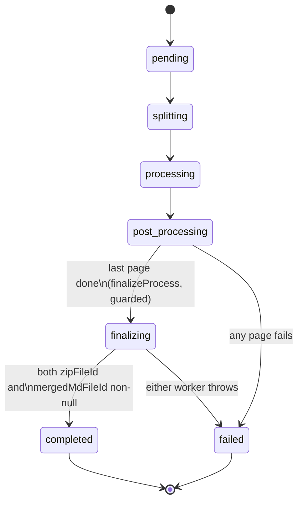
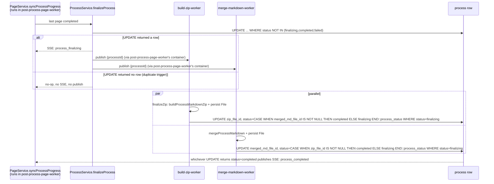

# Parallel process finalization (zip + merged markdown)

## Overview

Today, when the last page of a process finishes post-processing, `PageService.syncProcessProgress`
calls `ProcessService.completeProcess`, which flips `process.status` straight to `"completed"`. The
ZIP of per-page markdown files is built on demand, synchronously, on every download request
(`ProcessService.buildProcessMarkdownZip`, called from the download route) — it is never persisted.
There is no merged/combined markdown artifact anywhere.

This plan inserts an intermediate `"finalizing"` stage between the last page finishing and the
process reaching `"completed"`. Entering `"finalizing"` fans out to two independent AMQP workers:

- `build-zip-worker` — persists the existing per-page-markdown ZIP as a `File` row, writes
  `process.zipFileId`.
- `merge-markdown-worker` — concatenates every page's markdown into one file, persists it as a
  `File` row, writes a new `process.mergedMdFileId`.

Each worker performs one atomic, conditional SQL update on completion; whichever finishes second
flips `status` to `"completed"`. If either fails, the process moves to `"failed"` and the other
worker's later success cannot silently overwrite that.

## Problem Frame

The product wants two deliverables per process (a ZIP and a single reconstructed markdown file)
built once, after the pipeline finishes, instead of rebuilding the ZIP on every download. Because
the two artifacts are independent and have no ordering requirement between them, they should run
concurrently rather than one blocking the other — but the pipeline still needs a single, unambiguous
"is the process actually done" signal for the rest of the system (SSE notifications, the process
list UI, download availability).

## Requirements Trace

- R1. When the last page of a process completes, the process enters an intermediate `finalizing`
  status instead of going directly to `completed`.
- R2. Two independent treatments run in parallel from that point: building/persisting the ZIP, and
  building/persisting a merged markdown file.
- R3. The process carries two nullable pointer fields to the two output files; the process is
  considered fully done once both are non-null, at which point status becomes `completed`.
- R4. No catch-up: only processes that reach "last page done" after this ships go through
  `finalizing`. Processes already `completed` (or in flight) before deployment are never
  retroactively populated.
- R5. The existing ZIP download route serves the persisted file instead of rebuilding it per
  request.

## Scope Boundaries

- No backfill migration or reprocessing script for existing/historical processes — explicitly out
  of scope per R4. Old completed processes will have `zipFileId`/`mergedMdFileId` permanently null
  and the ZIP download route will no longer serve them (no on-the-fly fallback). This is an accepted,
  deliberate regression for pre-migration processes, not an oversight. **A confidence-check reviewer
  proposed a narrower alternative** — keep `buildProcessMarkdownZip` as a fallback strictly when
  `zipFileId IS NULL AND status = 'completed'` (i.e. only for rows that predate this migration),
  which achieves "no backfill work" with no collateral damage to historical downloads. This was
  explicitly re-confirmed as declined: the product decision is a clean break, not a fallback, so this
  alternative is recorded here for traceability only and is not part of the plan.
- No retry/DLQ handling for the two new workers — matches the existing repo-wide pattern
  (`channel.nack(msg, false, false)`, no requeue). A lightweight, non-blocking monitoring addition
  (Unit 7) makes stuck processes *visible* without adding retry machinery.
- No UI changes beyond what's needed to expose the new markdown download link; no redesign of the
  process list/status UI.
- No change to the per-page pipeline (split → transcribe → post-process) itself — the fan-out point
  is strictly "all pages done."

## Context & Research

### Relevant Code and Patterns

- `packages/services/src/page/page.service.ts:398-475` (`syncProcessProgress`) — the existing
  count-based "last page done" detection; the only call site that must be changed to trigger the new
  flow (calls `processService.completeProcess` today). **This method runs inside
  `workers/post-process-page-worker`'s handler chain, not inside `apps/web`** — this is load-bearing
  for where the new publishers get wired (see Key Technical Decisions and Unit 6).
- `packages/services/src/process/process.service.ts:501-529` (`completeProcess`) and `:531-561`
  (`failProcess`) — current unconditional read-then-write completion/failure pattern; the model to
  extend, not replace wholesale.
- `packages/services/src/process/process.service.ts:203-275` (`buildProcessMarkdownZip`) — already
  builds exactly the "zip of all page markdowns" artifact the feature asks for. It currently (a)
  requires `process.status === "completed"` (throws `PROCESS_OUTPUT_INCOMPLETE`/`PROCESS_NOT_COMPLETED`
  otherwise) and (b) is scoped by `userId` for the download route's auth check. Both need to change
  for worker-triggered, pre-`completed` use (see Key Technical Decisions).
- `packages/services/src/process/process.service.ts:277-332` (`deleteProcess`) — already collects
  `zipFileId` into the files-to-delete array; `mergedMdFileId` slots in the same way. Confirmed safe:
  `deleteProcess` deletes the `process` row *before* calling `filesService.deleteFiles`, so the
  `onDelete: "set null"` FK behavior is never actually exercised on this path — no ordering hazard.
- `packages/services/src/files/files.service.ts:134-173` (`createPageMarkdownFile`) — the pattern to
  mirror for persisting new `File` rows (S3 `PutObjectCommand` + `db.insert(schema.file)`), since no
  generic "create file" helper exists in this codebase (re-verified directly, confirmed absent).
  Exact object-key convention confirmed: `` `pages/${pageId}/${markdownFileId}.md` `` — i.e.
  `<entity-kind-plural>/${parentEntityId}/${newFileId}.<ext>`. The two new methods follow this
  exactly: `` `processes/${processId}/${fileId}.zip` `` and `` `processes/${processId}/${fileId}.md` ``.
- `db/src/schemas/process.ts:6-46` — `processStatus` pg enum already contains `"finalizing"`
  (unused) and `process.zipFileId` already exists (unused) — both were seemingly added in
  anticipation of this feature.
- `db/src/schemas/file.ts:4-9` — `fileKind` pg enum already contains `"zip"` (unused) alongside
  `source_pdf`, `page_image`, `page_markdown`. A new kind literal is needed for the merged markdown
  file (e.g. `"process_markdown"`).
- `packages/infra/src/amqp/amqp.publisher.ts` (new, uncommitted) + migrated publishers
  (`workers/transcribe-jpg-worker/src/publisher.ts`) — the exact shape new publishers must follow:
  wrap `createResilientPublisher({ amqpUrl, queue, workerName })`, validate with a zod schema before
  `publish`, delegate `close()`.
- `workers/split-pdf-worker/` — full worker package template (`index.ts`, `container.ts`,
  `consumer.ts`, `publisher.ts`, `contracts/*.schema.ts`, `handler/*.handler.ts`, `package.json`,
  `tsconfig.json`, `tsconfig.build.json`, `Dockerfile`) to copy for the two new worker packages.
  Confirmed `tsconfig.build.json` content (identical across workers, only `rootDir`/`outDir` stay
  `src`/`dist`):
  ```json
  {
    "compilerOptions": {
      "target": "ES2022", "module": "NodeNext", "moduleResolution": "NodeNext",
      "rootDir": "src", "outDir": "dist", "declaration": true, "declarationMap": true,
      "sourceMap": true, "strict": true, "types": ["node"], "skipLibCheck": true
    },
    "include": ["src/**/*.ts"], "exclude": ["dist", "node_modules"]
  }
  ```
  referenced by `package.json`'s `"build": "rm -rf dist && tsc -p tsconfig.build.json"`.
- **`workers/cleanup-process-worker/`** — the one existing worker that does *not* follow the
  4-file-plus-handler shape: it's cron-triggered (`node-cron`), has no `consumer.ts`, no
  `publisher.ts`, no `./publisher` export. Confirms CLAUDE.md's "always these four files" applies to
  queue-consumer workers, not every worker package.
- `packages/common/src/app-error.ts` + `apps/web/src/libs/server/errors.ts` — `APP_ERROR` is a flat
  `SCREAMING_SNAKE_CASE` record, `appErrorStatusCode` is an exhaustive `Record<AppErrorCode, number>`
  (compile error if a new code isn't mapped) — both files must be touched together.
- `packages/common/src/types/processStatusEvent.type.ts:3-9` — `processStatusStageSchema`, needs a
  new `"process_finalizing"` literal.
- **`workers/post-process-page-worker/src/container.ts`** — not `apps/web/src/libs/server/container.ts`
  — is where the two new publishers must be instantiated and injected into `ProcessService`, since
  that's the container that actually calls `syncProcessProgress` → `finalizeProcess` (see Key
  Technical Decisions). `apps/web`'s `ProcessService` instance does not need either new publisher —
  it only ever reads `zipFileId`/`mergedMdFileId` for downloads, never triggers finalization.
- `apps/web/src/libs/server/metrics.ts` (`KNOWN_ROUTES`) — new download route must be registered or
  its metrics silently collapse into `other`. Also has a live precedent for a state gauge
  (`sseStreamsActive`) to extend for Unit 7's stale-`finalizing` monitoring.
- `packages/infra/src/configs/env.ts:33-38` — per-queue env var pattern (`AMQ_<NAME>_QUEUE`,
  `AMQ_<NAME>_PREFETCH`) to replicate for the two new queues.
- Root `package.json`'s `build:runtime` builds every worker *before* `@ocr/services` (services
  imports worker publishers as types). The two new workers must build even earlier than that,
  **before `@ocr/post-process-page-worker`** specifically (not just before `@ocr/services`), because
  `post-process-page-worker`'s container will import the new publishers' actual runtime classes
  (resolved via each package's `exports.default` → `dist/publisher.js` at runtime), not just their
  types.
- `docker-compose.prod.yaml` + `README.md:96-105` — this repo deploys all-at-once
  (`docker compose ... up -d --build --remove-orphans`), not via rolling deploy. `db-migrate` is a
  one-shot service every other service `depends_on: db-migrate: condition: service_completed_successfully`
  — migration-before-app-code ordering is already handled by the existing compose graph, provided the
  two new worker services are added to it (see Unit 6).
- `apps/web/src/routes/downloads/processes/$id.ts` — a pure server route
  (`createFileRoute("/downloads/processes/$id")({ server: { handlers: { GET: ... } } })`), registered
  automatically in the generated `routeTree.gen.ts`. Confirmed via TanStack Start's own bundled
  routing convention doc: a route with an extra static segment under a dynamic `$id` must turn `$id`
  into a **directory**, not a dot-file — i.e. the new markdown route is
  `apps/web/src/routes/downloads/processes/$id/markdown.ts`, not `$id.markdown.ts`. No existing
  example of this nesting exists yet in this repo, but nothing about the two coexisting (`$id.ts` and
  `$id/markdown.ts`) conflicts per the routing doc.

### Institutional Learnings

- `docs/solutions/` does not exist in this repo — no institutional learnings to carry forward.

### External References

- [Drizzle ORM — Update docs](https://orm.drizzle.team/docs/update) — confirms the `sql` CASE
  expression syntax inside `.set()`.
- [PostgreSQL — Type Resolution for `CASE` and `UNION`](https://www.postgresql.org/docs/current/typeconv-union-case.html)
  — Rule 3 explains why an all-`unknown`-literal `CASE` expression resolves to `text`, which is the
  root cause of the enum-cast gotcha in Key Technical Decisions.

## Key Technical Decisions

- **Atomic conditional UPDATE for the race-free join — confirmed correct under this codebase's
  actual concurrency model, with one required fix (enum cast).** There is zero pre-existing
  precedent in this repo for a `sql` CASE expression or a conditional-WHERE optimistic update.
  `completeProcess`/`failProcess` are read-then-write with no compare-and-swap. This plan introduces,
  for the first time, an update shaped like:
  ```sql
  UPDATE process
  SET zip_file_id = $1,
      status = CASE WHEN merged_md_file_id IS NOT NULL THEN 'completed' ELSE 'finalizing' END::process_status
  WHERE id = $2 AND status = 'finalizing'
  RETURNING *;
  ```
  **The `::process_status` cast is not optional.** `status` is a `pgEnum` column; `'completed'` and
  `'finalizing'` are untyped string literals, so per Postgres's own type-resolution rules for `CASE`
  (all-`unknown` inputs resolve to `text`), the whole expression resolves to `text` by default —
  assigning `text` to an enum column has no implicit cast and fails at runtime
  (`column "status" is of type process_status but expression is of type text`). This is not caught by
  TypeScript (`.set()` accepts `SQL<unknown>` for any column) — it only surfaces against a live
  Postgres instance. Every one of the four conditional-UPDATE call sites below (`finalizeProcess`,
  `markZipReady`, `markMergedMdReady`, `failFinalization`) that assigns a literal status via `sql`
  must include this cast.

  **Correctness under concurrency, confirmed definitively (not a hedge):** this codebase runs every
  mutation as a single bare `db.update(...)` statement at Postgres's default READ COMMITTED, with no
  wrapping transaction and no isolation override anywhere (`db/src/index.ts` calls
  `drizzle(env.PG_URL, ...)` plain). Under READ COMMITTED, when two workers' UPDATEs target the same
  row concurrently: the first to arrive acquires the row lock; the second blocks until the first
  commits, then Postgres's **EvalPlanQual** mechanism re-fetches the just-committed row and
  re-evaluates the second UPDATE's `WHERE` clause *and* its `CASE WHEN` expression against that fresh
  version — not a stale snapshot. This is the same mechanism that makes `UPDATE t SET x = x + 1` safe
  for concurrent increments. So whichever of the two workers' UPDATEs runs second is guaranteed to see
  the first one's already-committed field, correctly resolve `CASE WHEN <other field> IS NOT NULL` to
  `'completed'`, and the guard composes correctly. **This guarantee depends on each conditional UPDATE
  remaining a single autocommit statement** — if a future refactor wraps one of these four methods in
  an explicit `db.transaction()` at an isolation level above READ COMMITTED, the guarantee breaks
  silently (a REPEATABLE READ/SERIALIZABLE transaction would instead throw a serialization failure,
  which is safe but different — it would need an app-level retry that doesn't currently exist).
- **`finalizeProcess` needs the SAME conditional guard, for a different reason, AND — corrected —
  the guard must gate every side effect, not just the SSE event.** `syncProcessProgress` calls
  `finalizeProcess` from a plain count check with no locking, so nothing prevents two near-simultaneous
  page completions from both observing "last page done" and both calling `finalizeProcess`.
  `finalizeProcess`'s own UPDATE uses `WHERE id = $1 AND status NOT IN ('finalizing', 'completed',
  'failed')` so a duplicate call is a no-op at the DB layer. **A confidence-check review found a real
  bug in this plan's original wording**: it described gating the `process_finalizing` SSE publish on
  the UPDATE's returned row, but did not equally gate the two queue publishes — as written, both
  concurrent `finalizeProcess` calls would fall through to "publish to both queues" regardless of
  which one actually won the UPDATE, causing `build-zip-worker`/`merge-markdown-worker` to each
  receive two messages for the same `processId`. This doesn't corrupt the `process` row (the
  downstream guards absorb it), but it does cause duplicate S3 writes and duplicate orphaned `file`
  rows that nothing else cleans up. **Fix, now load-bearing for Unit 3**: `finalizeProcess` must check
  `.returning()`'s result and return early — skipping the SSE publish *and* both queue publishes —
  when it comes back empty.
- **`buildProcessMarkdownZip` needs two changes to be safely reusable by `build-zip-worker`**: (1)
  its status guard currently requires `process.status === "completed"` — it must instead accept
  `"finalizing"` (its only remaining caller after this change, since the download route stops calling
  it live); (2) it takes `userId` for the download route's ownership check, but the worker only has
  `processId` from the AMQP payload — the worker handler should call `getProcessById(processId)`
  first to obtain `userId`, then pass both through unchanged, rather than adding a second
  no-userId code path that duplicates the query logic.
- **New `mergeProcessMarkdown(processId)` method takes no `userId`** — unlike
  `buildProcessMarkdownZip`, it has no pre-existing user-facing caller, so there's no ownership check
  to preserve; it's purely internal/system-triggered.
- **File persistence stays inside `FilesService`, orchestration stays inside `ProcessService` —
  corrected to be symmetric across both artifacts.** The plan originally had `mergeProcessMarkdown`
  do build+persist+return-id entirely inside `ProcessService` (calling `FilesService` internally),
  but described the ZIP path as three separate calls made directly from the **worker handler**
  (`ProcessService.buildProcessMarkdownZip` → `FilesService.createProcessZipFile` →
  `ProcessService.markZipReady`), which is an inconsistent boundary: `build-zip-worker`'s handler
  would need to know about `FilesService` directly, which no other worker in this codebase does (every
  existing worker only talks to the one service that owns its stage). **Fix**: add a single
  `ProcessService.finalizeZip(processId, userId)` method that internally does build → persist (via
  `filesService.createProcessZipFile`) → `markZipReady`, mirroring `mergeProcessMarkdown`'s shape
  exactly. Both worker handlers then make exactly two calls each: fetch `userId` if needed, then one
  `ProcessService` method that does everything, then rely on that method's own try/catch to call
  `failFinalization` on error (see Units 3-5). Two new `FilesService` methods are still added
  (`createProcessZipFile`, `createProcessMarkdownFile`), mirroring `createPageMarkdownFile`'s
  S3-write + `db.insert(schema.file)` shape — no generic "create file" abstraction is introduced,
  matching the codebase's one-bespoke-method-per-file-type convention (re-verified: no such generic
  helper exists anywhere in `FilesService` today).
- **New `fileKind` literal**: reuse the existing unused `"zip"` literal for the ZIP file (matches
  `zipFileId`'s pre-existing, unused intent exactly); add one new literal (`"process_markdown"`) for
  the merged markdown file.
- **SSE stage granularity**: a single new `"process_finalizing"` stage fires once when
  `finalizeProcess` succeeds; `"process_completed"` continues to fire exactly once, from whichever
  worker's atomic update actually transitions status to `"completed"`. No per-worker
  (`build_zip`/`merge_markdown`) SSE events are added.
- **Failure is symmetric with success**: `failFinalization(processId, error)` uses the same
  `WHERE status = 'finalizing'` guard, so whichever of (worker A fails) / (worker B fails) /
  (both succeed) happens first and lands first wins, and a late arrival from the other worker cannot
  overwrite it.
- **Publishers are wired into the wrong container in the plan's first draft — corrected.** Because
  `finalizeProcess` is called from `syncProcessProgress`, which runs inside
  `workers/post-process-page-worker`'s handler chain (not `apps/web`), the two new publishers
  (`BuildZipPublisher`, `MergeMarkdownPublisher`) must be instantiated inside
  `workers/post-process-page-worker/src/container.ts` and injected into **that** container's
  `ProcessService` instance — mirroring exactly how `transcribe-jpg-worker/src/container.ts`
  constructs the downstream `PostProcessPagePublisher` today. `apps/web`'s `ProcessService` instance
  does not need either new publisher as a dependency (it never calls `finalizeProcess`), so Unit 6's
  original plan to wire them into `apps/web/src/libs/server/container.ts` is removed. Both publisher
  classes still live in their own worker packages and still export `./publisher` — they ARE consumed,
  just by `post-process-page-worker`'s container instead of `apps/web`'s.
- **Download route regression is intentional**: the ZIP download route will read `zipFileId` and
  serve it directly; no fallback to `buildProcessMarkdownZip` is added for processes where
  `zipFileId` is null. Pre-migration completed processes become permanently non-downloadable via
  this route. This was explicitly chosen over adding a legacy fallback (see Scope Boundaries for the
  alternative that was surfaced and declined).
- **Stuck-`finalizing` visibility, not retry**: per the existing no-retry/no-DLQ stance, a message
  that's lost entirely (not merely nacked-and-observed, but never delivered at all — a crash-looping
  container, a misrouted queue) leaves a process in `finalizing` forever with one field set, with no
  operator visibility today. Rather than adding retry/DLQ machinery (explicitly out of scope), Unit 7
  adds a cheap Prometheus gauge sampling `finalizing` rows older than a threshold, extending the
  existing `/metrics` pattern with zero new infrastructure.

## Open Questions

### Resolved During Planning

- Fan-out granularity (2 workers vs. 1) → 2 separate worker packages/queues, matching the repo's
  one-package-per-queue convention.
- Race condition on the completed/failed transition → atomic conditional `UPDATE ... WHERE status =
  'finalizing'` per writer, no application-level locking. Confirmed correct under this codebase's
  actual READ COMMITTED, no-wrapping-transaction execution model (see Key Technical Decisions).
- Which DB column to use for the ZIP pointer → reuse existing unused `zipFileId`; add one new
  `mergedMdFileId` column.
- Legacy/pre-migration download behavior → no fallback; explicitly breaking, no backfill (re-confirmed
  after a reviewer proposed a narrower alternative — see Scope Boundaries).
- SSE event granularity → one new `process_finalizing` stage only.
- Merged markdown format → simple `\n\n`-joined concatenation in page-number order, no separators.
- Where new business logic lives → `ProcessService`, no new domain/service.
- Cleanup on process deletion → `mergedMdFileId` added to `deleteProcess`'s existing file-cleanup
  list, same treatment as `zipFileId`. Confirmed no FK/ordering hazard (process row deleted before
  file cleanup runs).
- Object-key naming convention for the two new S3 objects → confirmed:
  `` `processes/${processId}/${fileId}.zip` `` / `` `processes/${processId}/${fileId}.md` ``,
  mirroring `createPageMarkdownFile`'s exact pattern.
- Whether `tsconfig.build.json` exists per-worker → confirmed yes; exact content captured in Context
  & Research above, to be copied verbatim (only `rootDir`/`outDir` are package-invariant, nothing else
  changes).
- Nested download route file-naming convention → confirmed:
  `apps/web/src/routes/downloads/processes/$id/markdown.ts` (directory-nested, not a dot-file
  sibling of `$id.ts`).
- Which container wires the two new publishers → `workers/post-process-page-worker/src/container.ts`,
  not `apps/web`'s container (corrected from the plan's first draft — see Key Technical Decisions).
- Postgres enum-column CASE assignment → requires an explicit `::process_status` cast on every
  conditional-UPDATE call site; without it, the statement fails at runtime, not at compile time.
- Migration safety against a live database → confirmed safe: Postgres 18-alpine (per
  `docker-compose.yaml`), nullable column with no default (metadata-only, no table rewrite), new enum
  literal not used within the same migration (avoids the classic `ADD VALUE` same-transaction
  restriction entirely, moot on PG12+ anyway).

### Deferred to Implementation

- Exact new `APP_ERROR` code name(s) for finalization failure — a single generic code (e.g.
  `PROCESS_FINALIZATION_FAILED`) vs. one per worker. Recommend starting with one shared code since
  the failure is surfaced to the user identically either way (process shows `failed`); revisit only
  if the UI needs to distinguish which artifact failed.
- Whether the merged-markdown download route needs its own `Content-Disposition`/filename
  convention distinct from the ZIP route — follow the ZIP route's existing pattern unless it doesn't
  translate directly.
- Whether to add an active reconciliation job (auto-transition stale `finalizing` rows to `failed`
  via the same guarded UPDATE, e.g. piggybacked on `cleanup-process-worker`'s existing 2-hourly cron)
  in addition to Unit 7's passive monitoring gauge. A confidence-check reviewer suggested this as a
  belt-and-suspenders option; it's a genuine scope expansion beyond what was decided during grilling
  (no retry/reconciliation machinery), so it's recorded here as an optional future enhancement, not
  committed to this plan. Unit 7 (visibility only) is the one item from that review actually adopted.
- Orphaned-file sweep (a `file` row of kind `zip`/`process_markdown` persisted via S3 but never
  referenced by a `process` row, because the worker crashed between the S3 write and the
  `markXReady` update) — same reasoning as above: a real, low-severity gap, deliberately deferred
  rather than expanding scope.

## High-Level Technical Design





## Implementation Units

- [ ] **Unit 1: Database schema — merged markdown column + file kind**

**Goal:** Add the second output pointer column and the new file-kind literal needed to persist the
merged markdown file.

**Requirements:** R3

**Dependencies:** None

**Files:**
- Modify: `db/src/schemas/process.ts` (add `mergedMdFileId`, mirroring `zipFileId` exactly: FK →
  `file.id`, `onDelete: "set null"`, nullable)
- Modify: `db/src/schemas/file.ts` (add `"process_markdown"` to the `fileKind` pg enum)
- Generated: `db` migration folder (via `pnpm db:generate`) — review the generated SQL before
  running `pnpm db:migrate`

**Approach:**
- No change to the `process_status` enum — `"finalizing"` already exists.
- No data backfill in the migration — new column defaults to `NULL` for all existing rows, which is
  exactly the desired "no catch-up" behavior (R4) with zero extra code.
- Confirmed safe against a live database: nullable column with no default is metadata-only in
  PG11+ (no table rewrite), and the new enum literal is not referenced within the same migration, so
  the classic "can't use a value added in the same transaction" restriction never applies.

**Patterns to follow:**
- `db/src/schemas/process.ts:26-28` (`zipFileId` column definition) — copy verbatim for
  `mergedMdFileId`, only renaming the field/column name.

**Test scenarios:**
- Test expectation: none — schema-only change, verified by running `pnpm db:migrate` against the dev
  database and confirming the column/enum value exist (`\d process`, `\dT+ file_kind` in psql).

**Verification:**
- `pnpm db:generate` produces a migration containing exactly one new column and one new enum value,
  no unrelated diffs.
- Existing rows in `process` have `merged_md_file_id = NULL` after migrating.

---

- [ ] **Unit 2: Shared contracts — error codes, SSE stage, env config**

**Goal:** Wire the new stage name, failure error code, and per-queue environment variables needed by
every other unit before they're written.

**Requirements:** R1, R2

**Dependencies:** None (can run in parallel with Unit 1)

**Files:**
- Modify: `packages/common/src/types/processStatusEvent.type.ts` (add `"process_finalizing"` to
  `processStatusStageSchema`)
- Modify: `packages/common/src/app-error.ts` (add one new code, e.g.
  `PROCESS_FINALIZATION_FAILED: "PROCESS_FINALIZATION_FAILED"`, in the existing `PROCESS_*` bucket)
- Modify: `apps/web/src/libs/server/errors.ts` (`appErrorStatusCode` — map the new code to `500`,
  same bucket as other "inconsistent internal state" codes like `FILE_CONTENT_NOT_FOUND`)
- Modify: `packages/infra/src/configs/env.ts` (add `AMQ_BUILD_ZIP_QUEUE`/`AMQ_BUILD_ZIP_PREFETCH` and
  `AMQ_MERGE_MARKDOWN_QUEUE`/`AMQ_MERGE_MARKDOWN_PREFETCH`, same shape/defaults as existing queue
  entries)
- Modify: `.env.exemple`, `.env.docker.example` (add the four new variables)

**Approach:**
- Keep the DB `process_status` enum and the zod `processStatusStageSchema` mentally in sync per
  CLAUDE.md, even though this particular addition (`process_finalizing`) is a *stage* addition, not a
  1:1 mirror of a DB status value (the existing enum already has 5 stages for 7 DB statuses — stages
  represent "events," not every DB state).

**Patterns to follow:**
- `packages/infra/src/configs/env.ts:33-38` — exact shape for the two new queue env var pairs.
- `packages/common/src/app-error.ts` — flat `SCREAMING_SNAKE_CASE`, key === value.

**Test scenarios:**
- Test expectation: none — type/config-only change; a missing env var will crash the process at
  boot by existing design, which is the intended verification signal.

**Verification:**
- `pnpm build` (or `tsc` on `@ocr/common`) fails to compile if `appErrorStatusCode` isn't updated to
  match the new `APP_ERROR` key (TypeScript exhaustiveness check) — confirms the wiring is complete.

---

- [ ] **Unit 3: `ProcessService` / `FilesService` / `PageService` orchestration logic**

**Goal:** Implement the actual finalize → parallel-write → completed/failed state machine as
service-layer methods, independent of any worker/queue plumbing.

**Requirements:** R1, R2, R3

**Dependencies:** Unit 1 (schema), Unit 2 (error code, stage)

**Files:**
- Modify: `packages/services/src/process/process.service.ts`
  - Replace `completeProcess` with `finalizeProcess(processId, completedPages)`: conditional UPDATE
    to `status = "finalizing"` (guard: `status NOT IN ('finalizing','completed','failed')`). **If the
    UPDATE returns no row, return immediately — do not publish the SSE event and do not publish to
    either queue** (this is the corrected gating from Key Technical Decisions; the original three
    side effects must all be conditioned on the same check, not just the SSE one). If it returns a
    row, publish `process_finalizing` SSE, then publish `{ processId }` to both injected publishers.
  - Add `finalizeZip(processId, userId)`: calls `buildProcessMarkdownZip(processId, userId)`, then
    `filesService.createProcessZipFile(...)`, then the atomic conditional UPDATE (`markZipReady`'s
    body, inlined or called as a private step) — one method the worker handler calls end-to-end, not
    three separate calls made from the handler (see Key Technical Decisions' boundary fix).
  - Add `markZipReady(processId, zipFileId)` and `markMergedMdReady(processId, mergedMdFileId)`:
    each does the atomic conditional UPDATE, with the `::process_status` cast on the `CASE`
    expression, publishes `process_completed` SSE only if the returned row's `status ===
    "completed"`.
  - Add `failFinalization(processId, error)`: same shape as existing `failProcess`, guarded by
    `WHERE status = 'finalizing'`.
  - Add `mergeProcessMarkdown(processId)`: mirrors `buildProcessMarkdownZip`'s page query (ordered by
    `pageNumber`, same `PROCESS_OUTPUT_INCOMPLETE` guard), joins page markdown contents with `"\n\n"`,
    calls the new `filesService.createProcessMarkdownFile(...)`, then `markMergedMdReady` — same
    end-to-end shape as `finalizeZip`, so both worker handlers call exactly one `ProcessService`
    method each for their entire happy path.
  - Change `buildProcessMarkdownZip`'s status guard from `=== "completed"` to `=== "finalizing"`.
  - Update `deleteProcess` to include `mergedMdFileId` in the files-to-delete array (same line as
    the existing `zipFileId` collection).
  - Add `buildZipPublisher?` and `mergeMarkdownPublisher?` to `ProcessServiceDependencies`, imported
    as types from the two new worker packages' `./publisher` exports (same pattern as
    `splitPdfPublisher`/`transcribeJpgPublisher`). Only `workers/post-process-page-worker`'s
    container actually instantiates and injects these — `apps/web`'s container does not.
- Modify: `packages/services/src/files/files.service.ts`
  - Add `createProcessZipFile(processId, buffer, filename)` and
    `createProcessMarkdownFile(processId, content, filename)`, mirroring `createPageMarkdownFile`'s
    S3-write + `db.insert(schema.file)` shape, with `kind: "zip"` / `kind: "process_markdown"`
    respectively, object keys `` `processes/${processId}/${fileId}.zip` `` /
    `` `processes/${processId}/${fileId}.md` ``.
- Modify: `packages/services/src/page/page.service.ts`
  - `syncProcessProgress`: change the "all pages completed" branch from calling
    `processService.completeProcess(...)` to `processService.finalizeProcess(...)`.

**Approach:**
- Use Drizzle's `sql` tag + `and(eq(...), eq(...))` for every conditional UPDATE (`finalizeProcess`,
  `markZipReady`, `markMergedMdReady`, `failFinalization`) — this is a new idiom for the codebase (see
  Key Technical Decisions), so keep all four implementations visually consistent (same helper shape)
  to make the pattern easy to review and reuse. **Every one that assigns a literal status string via
  `sql` must cast it `::process_status`** — confirmed required, not optional, by external research
  into Postgres's `CASE`/`UNION` type-resolution rules.
- `markZipReady`/`markMergedMdReady` each check `.returning()`'s result: empty array → guard missed
  (already `failed` or already `completed` from a duplicate delivery) → log and return without
  publishing anything; non-empty with `status === "completed"` → publish `process_completed`;
  non-empty with `status === "finalizing"` → no SSE event (still waiting on the other worker).

**Patterns to follow:**
- `packages/services/src/process/process.service.ts:501-561` (`completeProcess`/`failProcess`) for
  overall method shape (fetch-or-not, `InternalError` usage, SSE publish call).
- `packages/services/src/files/files.service.ts:134-173` (`createPageMarkdownFile`) for the new
  `FilesService` methods.
- `packages/services/src/page/page.service.ts:163` (`sql\`${...} + 1\``) as the only existing
  precedent for `sql`-tag usage in this codebase — note this precedent never needed a cast because
  integer arithmetic naturally resolves to `integer`, unlike the enum-column CASE this plan adds.

**Test scenarios:**
- Happy path: `finalizeProcess` on a process in `post_processing` → row transitions to `finalizing`,
  both publishers' `publish` called once each, `process_finalizing` SSE published once.
- Idempotency: `finalizeProcess` called twice in a row (or concurrently) for the same process →
  exactly one call's UPDATE returns a row; the other returns empty and must skip BOTH the SSE publish
  and BOTH queue publishes (regression test for the gating bug found during confidence-check).
- Race, zip-first: `markZipReady` then `markMergedMdReady` on the same process → first call leaves
  status `finalizing`, no SSE; second call transitions to `completed`, publishes `process_completed`
  exactly once.
- Race, simultaneous: both `markZipReady` and `markMergedMdReady` invoked concurrently (simulate with
  two overlapping DB calls in the test, e.g. `Promise.all`) → exactly one of them observes the other's
  field as non-null and transitions to `completed`; total `process_completed` publishes across both
  calls is exactly one.
- Enum cast regression: `markZipReady`/`markMergedMdReady`/`finalizeProcess`/`failFinalization`
  against a real Postgres instance (not a mock) → the conditional UPDATE succeeds without a
  `column "status" is of type process_status but expression is of type text` error — this must be an
  integration-style test hitting real Postgres, since the cast bug is invisible to TypeScript and to
  any mocked-DB unit test.
- Failure guard: `failFinalization` called, then a late `markZipReady` arrives for the same process →
  the late call's UPDATE matches zero rows (guard is `WHERE status = 'finalizing'`, already `failed`),
  so neither the field nor the status changes.
- `mergeProcessMarkdown`: process with all pages having `markdownFileId` → returns a file id whose
  persisted content is the `\n\n`-joined concatenation in `pageNumber` order.
- `mergeProcessMarkdown`: a page missing `markdownFileId` → throws `PROCESS_OUTPUT_INCOMPLETE`.
- `buildProcessMarkdownZip` called while `process.status === "finalizing"` → succeeds (previously
  would have thrown `PROCESS_NOT_COMPLETED`).
- `deleteProcess`: process with both `zipFileId` and `mergedMdFileId` set → both file ids appear in
  the `filesService.deleteFiles` call.

**Verification:**
- A process that completes all pages ends up with `status === "completed"`, `zipFileId` non-null,
  `mergedMdFileId` non-null, having emitted exactly one `process_finalizing` and one
  `process_completed` SSE event, regardless of which of the two downstream workers finishes first.

---

- [ ] **Unit 4: `build-zip-worker` package**

**Goal:** New worker package that consumes `{ processId }` jobs and persists the ZIP.

**Requirements:** R2

**Dependencies:** Unit 3 (needs `ProcessService.finalizeZip`/`failFinalization`)

**Files:**
- Create: `workers/build-zip-worker/src/index.ts`
- Create: `workers/build-zip-worker/src/container.ts`
- Create: `workers/build-zip-worker/src/consumer.ts`
- Create: `workers/build-zip-worker/src/publisher.ts` (this IS consumed — by
  `workers/post-process-page-worker`'s container, which constructs it to enqueue jobs into this
  worker's queue, exactly like `transcribe-jpg-worker`'s publisher is consumed by
  `split-pdf-worker`'s container; keep the `./publisher` export)
- Create: `workers/build-zip-worker/src/contracts/build-zip.schema.ts` (`{ processId: string }` +
  `parseRawMessage`)
- Create: `workers/build-zip-worker/src/handler/build-zip.handler.ts`
- Create: `workers/build-zip-worker/package.json`, `tsconfig.json`, `tsconfig.build.json` (content
  confirmed identical to `split-pdf-worker`'s, see Context & Research)
- Create: `workers/build-zip-worker/Dockerfile` (mirror `workers/split-pdf-worker/Dockerfile`
  exactly — every existing worker has one; the plan's first draft omitted this)

**Approach:**
- Handler: parse `processId` → `processService.getProcessById(processId)` to get `userId` →
  `processService.finalizeZip(processId, userId)` (single call, does build+persist+atomic-update
  internally per Unit 3's boundary fix). On any thrown error, call
  `processService.failFinalization(processId, error)` before rethrowing (so the message still
  `nack`s per the existing no-retry pattern, but the process is left in a visible `failed` state, not
  stuck in `finalizing`).
- Container needs: `db`, `FilesService`, `ProcessService` (only the deps this worker actually uses —
  no `splitPdfPublisher`/`transcribeJpgPublisher`, no `buildZipPublisher`/`mergeMarkdownPublisher`
  either, since this worker is terminal), `ProcessStatusPubSubService`.

**Patterns to follow:**
- `workers/split-pdf-worker/` — full package layout template, including `Dockerfile` and
  `tsconfig.build.json`.
- `workers/post-process-page-worker/src/container.ts` — container shape for a worker with a
  no-op `init` and a `shutdown` that only closes what it constructed.

**Test scenarios:**
- Test expectation: none for consumer/container plumbing — no existing test harness precedent for
  worker consumers in this repo (deferred to implementation; verify manually via
  `docker compose up` + publishing a test message).
- Handler logic itself is a thin pass-through to `ProcessService.finalizeZip`/`failFinalization`,
  already covered by Unit 3's test scenarios.

**Verification:**
- Publishing `{ processId }` to the new queue results in `process.zipFileId` being set and the
  process transitioning to `completed` if `mergedMdFileId` was already set, or staying `finalizing`
  otherwise.

---

- [ ] **Unit 5: `merge-markdown-worker` package**

**Goal:** New worker package that consumes `{ processId }` jobs and persists the merged markdown
file.

**Requirements:** R2

**Dependencies:** Unit 3 (needs `ProcessService.mergeProcessMarkdown`/`failFinalization`)

**Files:**
- Create: `workers/merge-markdown-worker/src/index.ts`
- Create: `workers/merge-markdown-worker/src/container.ts`
- Create: `workers/merge-markdown-worker/src/consumer.ts`
- Create: `workers/merge-markdown-worker/src/publisher.ts` (consumed by
  `workers/post-process-page-worker`'s container, same reasoning as Unit 4)
- Create: `workers/merge-markdown-worker/src/contracts/merge-markdown.schema.ts`
- Create: `workers/merge-markdown-worker/src/handler/merge-markdown.handler.ts`
- Create: `workers/merge-markdown-worker/package.json`, `tsconfig.json`, `tsconfig.build.json`
- Create: `workers/merge-markdown-worker/Dockerfile` (mirror an existing worker's exactly)

**Approach:**
- Handler: parse `processId` → `processService.mergeProcessMarkdown(processId)` (single call, does
  build+persist+atomic-update internally, same shape as Unit 4's `finalizeZip`). Same
  `failFinalization`-on-error pattern as Unit 4.
- Container shape identical to Unit 4's, minus the ZIP-specific dependency.

**Patterns to follow:**
- Same as Unit 4 — these two worker packages should be near-identical in structure, differing only
  in the one `ProcessService` method they call.

**Test scenarios:**
- Same reasoning as Unit 4 — plumbing verified manually, business logic covered by Unit 3.

**Verification:**
- Publishing `{ processId }` to the new queue results in `process.mergedMdFileId` being set and the
  process transitioning to `completed` if `zipFileId` was already set, or staying `finalizing`
  otherwise.

---

- [ ] **Unit 6: Worker wiring + web app download routes + workspace/deploy tooling**

**Goal:** Connect the two new workers into the running system at the correct injection point, expose
the new artifacts via download routes, and wire the workspace build/deploy tooling end-to-end.

**Requirements:** R2, R5

**Dependencies:** Unit 4, Unit 5 (imports their `./publisher` exports)

**Files:**
- Modify: `workers/post-process-page-worker/src/container.ts` — instantiate `BuildZipPublisher` and
  `MergeMarkdownPublisher` (imported from `@ocr/build-zip-worker/publisher` /
  `@ocr/merge-markdown-worker/publisher`), inject both into this container's `ProcessService`
  instance, close both in `shutdown`. **Corrected from the plan's first draft**, which wired these
  into `apps/web`'s container — the actual call site (`syncProcessProgress` → `finalizeProcess`) runs
  here, not in the web app.
- Modify: `workers/post-process-page-worker/package.json` — add workspace dependencies on
  `@ocr/build-zip-worker` and `@ocr/merge-markdown-worker` (mirroring how `split-pdf-worker`'s
  `package.json` depends on `@ocr/transcribe-jpg-worker` for its downstream publisher type).
- Modify: `apps/web/src/routes/downloads/processes/$id.ts` (read `process.zipFileId`; if null, throw
  — no fallback to `buildProcessMarkdownZip`; else stream via `filesService.getFileBuffer`)
- Create: `apps/web/src/routes/downloads/processes/$id/markdown.ts` (confirmed exact path — `$id`
  becomes a directory, this is not a `$id.markdown.ts` dot-file), reading `process.mergedMdFileId`
  the same way, same error-handling shape as the sibling zip route.
- Modify: `apps/web/src/libs/server/metrics.ts` (`KNOWN_ROUTES` — add the new markdown route)
- Modify: root `package.json`:
  - Add `build-zip-worker:dev`/`merge-markdown-worker:dev` scripts, insert both into `workers:dev`'s
    `concurrently` list.
  - Insert both worker builds into `build:runtime` **before `@ocr/post-process-page-worker`**
    specifically (not merely "before `@ocr/services`") — `post-process-page-worker`'s container
    imports the new publishers' actual runtime classes (resolved to `dist/publisher.js` at runtime via
    each package's `exports.default`), so its build must come after theirs.
- Modify: `docker-compose.prod.yaml` — add service blocks for `build-zip-worker` and
  `merge-markdown-worker`, each with `depends_on: db-migrate: condition: service_completed_successfully`
  and `stop_grace_period: 30s`, matching the existing worker service blocks exactly. **The plan's
  first draft omitted this entirely** — without it, the new containers never deploy, and a later
  rollback via `--remove-orphans` has nothing to remove.
- Modify: `pnpm-workspace.yaml` — no change needed (globs `workers/*` already).

**Approach:**
- The download route change is the one user-visible regression in this plan (see Scope Boundaries) —
  implement it as a hard `PROCESS_OUTPUT_INCOMPLETE`-style throw when `zipFileId` is null, regardless
  of `status`, rather than special-casing "old" vs "new" processes.
- This repo deploys all-at-once (`docker compose ... up -d --build --remove-orphans`), not via
  rolling deploy — confirmed via `docker-compose.prod.yaml`'s `depends_on: db-migrate:
  condition: service_completed_successfully` graph on every service. This means the migration and all
  application code changes (including the two new worker containers) ship in one atomic restart; there
  is no window where old code runs against the new schema or vice versa, and no separate sequencing
  step is needed beyond ensuring the two new services are actually declared in the compose file.

**Patterns to follow:**
- Existing `apps/web/src/routes/downloads/processes/$id.ts` for the download route's error-handling
  and streaming conventions (route handlers that don't use a server function must replicate
  `withServerErrorLogging`'s error policy by hand, per CLAUDE.md).
- `workers/transcribe-jpg-worker/src/container.ts`'s existing construction of the downstream
  `PostProcessPagePublisher` as the template for `post-process-page-worker/src/container.ts`
  constructing the two new publishers.
- `docker-compose.prod.yaml`'s existing worker service blocks for the two new ones.

**Test scenarios:**
- Download route, zip: process with `zipFileId` set → 200 with the stored file's bytes.
- Download route, zip: process with `zipFileId` null (regardless of status) → error response, not a
  freshly-built zip.
- Download route, markdown: process with `mergedMdFileId` set → 200 with the stored file's bytes.
- Download route, markdown: process with `mergedMdFileId` null → error response.

**Verification:**
- `pnpm build` succeeds end-to-end with the new build-order entries.
- `pnpm dev` starts both new workers alongside the existing ones without port/queue collisions.
- `docker compose -f docker-compose.prod.yaml config` validates with the two new service blocks
  present and correctly depending on `db-migrate`.
- A fresh end-to-end run (upload → split → transcribe → post-process → finalizing → completed)
  produces a downloadable ZIP and a downloadable merged markdown file via the two routes.

---

- [ ] **Unit 7: Observability — stale-`finalizing` gauge**

**Goal:** Make a process stuck in `finalizing` (lost message, crash-looping worker) visible via the
existing `/metrics` endpoint, without adding retry/DLQ machinery.

**Requirements:** (supports R1-R3's operability, not a numbered product requirement)

**Dependencies:** Unit 1 (schema), Unit 6 (web app container is where this samples from)

**Files:**
- Modify: `apps/web/src/libs/server/metrics.ts` — add a `Gauge`, e.g.
  `ocr_web_processes_finalizing_stale`, following the existing `sseStreamsActive` gauge pattern.
- Modify: `apps/web/src/libs/server/container.ts` — add a `setInterval` (e.g. every 60s) alongside
  existing background wiring in `init`, running a count query and calling `.set(count)` on the gauge;
  clear the interval in `shutdown`.

**Approach:**
- Unlike `sseStreamsActive` (which has a natural inc/dec pair at a single call site), `finalizing`'s
  "enter" happens in `finalizeProcess` (in `post-process-page-worker`) and its "leave" happens in one
  of two other worker processes — no single in-process call site owns both transitions. A
  periodically-sampled gauge, not an inc/dec counter, is the right shape:
  ```sql
  SELECT COUNT(*) FROM process
  WHERE status = 'finalizing' AND updated_at < NOW() - INTERVAL '15 minutes';
  ```
  15 minutes gives headroom over normal ZIP/markdown build time for the largest expected process;
  confirm/tune against real page counts once in production.
- This is monitoring only — it does not change any process's state. Alerting on
  `ocr_web_processes_finalizing_stale > 0` for 5 minutes is an ops-side follow-up outside this repo's
  scope, not part of this unit.

**Patterns to follow:**
- `apps/web/src/libs/server/metrics.ts`'s existing `sseStreamsActive` `Gauge` and `trackSseStream`
  helper for the general shape of a gauge + its update site.

**Test scenarios:**
- Test expectation: none — a periodic monitoring query with no behavioral effect on the application;
  verify manually by seeding a stale `finalizing` row in the dev database and confirming the gauge
  reflects it on `/metrics` within one sample interval.

**Verification:**
- `/metrics` exposes `ocr_web_processes_finalizing_stale` and its value tracks the count of processes
  stuck in `finalizing` for more than 15 minutes.

## System-Wide Impact

- **Interaction graph:** `PageService.syncProcessProgress` is now one hop further from "process
  fully done" — it triggers `finalizeProcess`, not completion directly. `syncProcessProgress` runs
  inside `workers/post-process-page-worker`'s handler chain, which is why the two new publishers are
  wired into that worker's container, not `apps/web`'s (corrected during confidence-check).
- **Error propagation:** a new failure surface exists — either new worker can independently fail a
  process that had already finished all its pages successfully. This is a new way for a process to
  end up `failed` after the per-page pipeline fully succeeded; the process-list UI already handles
  `failed` from mid-pipeline errors, so no UI change is needed for this to display correctly.
- **State lifecycle risks:** a process can get stuck in `finalizing` forever only if a worker message
  is lost *before* the handler's catch block runs (e.g. process crash mid-handler, or a message never
  delivered at all) — this matches the existing repo-wide "no DLQ, no retry" risk profile for every
  other stage, not a new category of risk. Unit 7 makes this visible via a Prometheus gauge rather
  than leaving it silent; a confidence-check reviewer additionally suggested an active reconciliation
  job (auto-fail stale rows) and an orphaned-file sweep — both recorded as deliberately-deferred
  scope expansions in Open Questions, not implemented here.
- **API surface parity:** the merged-markdown download route is a genuinely new API surface (new
  route, new metrics label) with no prior parity target — its error-handling conventions must be
  written to match the ZIP route rather than copied loosely.
- **Deploy topology:** this repo deploys all six (soon eight) services at once via
  `docker-compose.prod.yaml`, gated on a one-shot `db-migrate` service every container
  `depends_on`. There is no rolling-deploy sequencing risk to design around, but the two new services
  must actually be declared in that compose file (Unit 6) or they never run, and a rollback that
  doesn't also revert the compose file will leave orphaned containers `--remove-orphans` can't find.

## Risks & Dependencies

| Risk | Mitigation |
|------|------------|
| Pre-migration `completed` processes become permanently non-downloadable via the ZIP route | Explicitly accepted per Scope Boundaries (a narrower fallback alternative was surfaced and explicitly declined); communicate to any support/ops process that historical downloads will start failing after deploy. |
| First-ever use of a `sql` CASE + conditional-WHERE pattern in this codebase, with a real Postgres-enum-cast gotcha that TypeScript cannot catch | Every conditional-UPDATE call site casts the `CASE` expression `::process_status` explicitly (confirmed required via Postgres's own type-resolution docs); Unit 3's test scenarios include an integration-style test against real Postgres specifically to catch a missing cast, since a mocked-DB unit test would not. |
| Concurrent-write correctness of the atomic UPDATE pattern | Confirmed safe under this codebase's actual READ COMMITTED, no-wrapping-transaction execution model via Postgres's EvalPlanQual mechanism — see Key Technical Decisions for the full mechanism, not just an assertion. This guarantee is contingent on each conditional UPDATE staying a single autocommit statement; flag in code review if a future change wraps one in an explicit transaction. |
| `finalizeProcess` double-firing on a last-page race, publishing duplicate jobs to both new queues | Fixed during confidence-check: the guard now gates the SSE publish AND both queue publishes, not just the SSE one (see Key Technical Decisions and Unit 3's idempotency test scenario). |
| Publishers wired into the wrong container would silently no-op (nothing would ever call `finalizeProcess` from `apps/web`) | Fixed during confidence-check: publishers move to `workers/post-process-page-worker`'s container, the actual call site. |
| Two new worker packages increase deploy/ops surface (2 more containers, 2 more queues to monitor, 2 more `Dockerfile`s) | Follows the exact existing package/container/compose pattern (Unit 6 adds the previously-missing `docker-compose.prod.yaml` service blocks and `Dockerfile`s), so operational tooling (health checks, `stop_grace_period`, etc.) generalizes without new design. |
| A process stuck in `finalizing` forever (lost message) is invisible today | Unit 7 adds a Prometheus gauge extending the existing `/metrics` pattern — visibility only, no retry/reconciliation logic added (deliberately deferred, see Open Questions). |
| Rollback: a process already sitting in `finalizing` when rolling back to the old `completeProcess`-only code has no code path to resolve it — the old code doesn't know about `finalizing` at all | Rollback runbook must include a one-time manual `UPDATE process SET status = 'failed' WHERE status = 'finalizing' AND updated_at < <rollback-time>` sweep; the schema migration itself (Unit 1) is purely additive and safe to leave in place during rollback — only application code needs reverting. |
| `buildProcessMarkdownZip`'s status-guard change (`completed` → `finalizing`) could silently break another, undiscovered caller | Grep for all call sites before changing the guard; the download route is being changed anyway in the same PR, so if it's truly the only other caller this is safe. |

## Sources & References

- **Origin document:** none — scoped via an interactive `/grill-me` session in this conversation,
  strengthened via a confidence-check pass (2026-08-05) using
  `cns:review:architecture-strategist`, `cns:research:framework-docs-researcher`,
  `cns:research:repo-research-analyst`, `cns:review:pattern-recognition-specialist`,
  `cns:review:data-integrity-guardian`, and `cns:review:deployment-verification-agent`.
- Related code: `packages/services/src/process/process.service.ts`,
  `packages/services/src/page/page.service.ts`, `packages/services/src/files/files.service.ts`,
  `db/src/schemas/process.ts`, `db/src/schemas/file.ts`, `packages/infra/src/amqp/amqp.publisher.ts`,
  `workers/split-pdf-worker/`, `workers/post-process-page-worker/`, `workers/cleanup-process-worker/`,
  `docker-compose.prod.yaml`, `apps/web/src/libs/server/metrics.ts`.
- External docs: [Drizzle ORM — Update](https://orm.drizzle.team/docs/update),
  [PostgreSQL — Type Resolution for CASE/UNION](https://www.postgresql.org/docs/current/typeconv-union-case.html).
